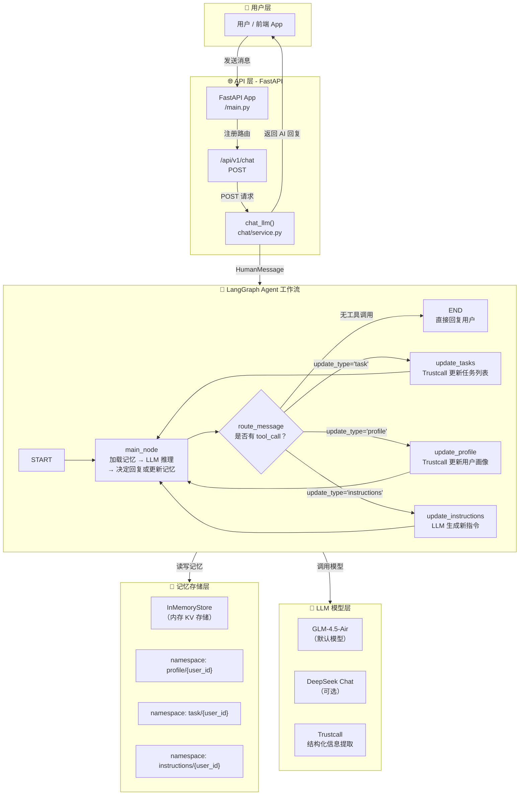

# 🍌 BananaList — AI 智能清单后端项目工作流程说明

> 基于 **FastAPI + LangGraph + GLM/DeepSeek** 的 AI 任务规划助手后端

---

## 一、项目概述

本项目是一个 **AI 驱动的智能清单规划后端服务**，核心能力：

- 接收用户自然语言输入，自动拆解为结构化任务
- 维护用户画像（Profile）、任务列表（Task）、用户偏好指令（Instructions）三种长期记忆
- 通过 LangGraph 状态机构建 AI Agent 工作流
- 提供 RESTful API 供前端调用

**技术栈：** Python 3.13 / FastAPI / LangChain / LangGraph / GLM-4.5-Air / DeepSeek / Trustcall

---

## 二、项目结构

```
backend/
├── app/                          # 应用主目录
│   ├── main.py                   # FastAPI 入口，挂载路由
│   ├── agents/
│   │   └── config.py             # 模型配置、System Prompt、Trustcall 指令
│   ├── chat/                     # 聊天 API 模块
│   │   ├── router.py             # POST /api/v1/chat 路由
│   │   ├── service.py            # 调用 LangGraph Agent
│   │   └── schemas.py            # 请求/响应 Pydantic 模型
│   ├── core/                     # 核心工具（旧版 deepagents，目前作为备份）
│   │   ├── config.py             # 全局配置（API Key、模型名等）
│   │   ├── llm.py                # deepagents 集成（未启用）
│   │   └── toolRegistory.py      # 工具注册器（未启用）
│   ├── graph/                    # ⭐ LangGraph Agent 工作流
│   │   ├── builder.py            # 构建状态图（StateGraph）
│   │   ├── nodes.py              # 各节点逻辑（main_node, update_*）
│   │   ├── routing.py            # 条件路由：决定下一步去哪个节点
│   │   ├── state.py              # Agent 状态定义（继承 MessagesState）
│   │   └── tools.py              # 暴露 UpdateMemory 工具
│   ├── schemas/
│   │   └── domain.py             # 领域模型：Profile, Task, UpdateMemory
│   ├── store/
│   │   └── memory.py             # 内存存储层（CRUD：profile/task/instructions）
│   └── task/                     # 任务 API 模块（预留，目前为空）
│       ├── router.py
│       ├── service.py
│       └── schemas.py
├── tests/
│   ├── test_graph.py             # 测试图编译
│   └── test_nodes.py             # 测试路由逻辑
├── .env                          # 环境变量（API Key、模型配置）
├── pyproject.toml                # 项目依赖
└── uv.lock                       # 锁定依赖版本
```

---

## 三、核心工作流程

### 3.1 整体架构流程图



### 3.2 详细流程说明

#### ① 用户发送消息

```
POST /api/v1/chat
Body: { "message": "帮我列一个周末出游清单" }
```

#### ② API 层处理

`chat/service.py` 中的 `chat_llm()` 函数将用户消息包装为 `HumanMessage`，调用 LangGraph Agent。

#### ③ LangGraph Agent 推理循环

Agent 的核心在 `app/graph/` 中，是一个 **有状态的条件循环图**：

1. **main_node**（主节点）
   - 从 Memory Store 加载该用户的 **Profile / Tasks / Instructions**
   - 将记忆拼入 System Prompt
   - 调用 LLM 推理
   - LLM 有两种输出可能：
     - **直接回复**（无 tool_call）→ 回到用户
     - **调用 UpdateMemory 工具**（有 tool_call）→ 进入更新分支

2. **条件路由** (`routing.py`)
   - 根据 `UpdateMemory.update_type` 的值决定下一节点：
     - `"task"` → 跳转 `update_tasks`
     - `"profile"` → 跳转 `update_profile`
     - `"instructions"` → 跳转 `update_instructions`
     - 无 tool_call → **结束**，返回回复

3. **三种记忆更新节点**
   - **update_tasks**：使用 Trustcall 提取用户消息中的任务信息，增量更新任务列表
   - **update_profile**：使用 Trustcall 提取用户身份/偏好信息，更新用户画像
   - **update_instructions**：用户对任务规划方式的偏好指令，由 LLM 生成

4. **循环**：更新完成后 **回到 main_node**，LLM 基于最新记忆生成最终回复

#### ④ 回复返回

Agent 最终回复的内容通过 API 返回给前端。

---

## 四、三种记忆模型

| 记忆类型 | 领域模型 | 存储命名空间 | 更新方式 | 作用 |
|---------|---------|-------------|---------|------|
| **Profile** | `Profile` 对象 | `profile/{user_id}` | Trustcall 提取 | 记住用户是谁（姓名、角色、偏好等） |
| **Task** | `Task` 对象列表 | `task/{user_id}` | Trustcall 提取（支持增量） | 跟踪用户的任务清单 |
| **Instructions** | 文本字符串 | `instructions/{user_id}` | LLM 直接生成 | 用户对任务规划方式的自定义规则 |

### Task 字段说明

| 字段 | 类型 | 说明 |
|------|------|------|
| `title` | str | 任务标题 |
| `description` | str? | 任务描述 |
| `assignee` | str? | 负责人 |
| `priority` | "P0" / "P1" / "P2" | P0=紧急当日 / P1=重要3日内 / P2=常规一周内 |
| `deadline` | str? | 截止日期（YYYY-MM-DD 或描述） |
| `pre_task` | str? | 前置任务标题 |
| `status` | "not started" / "in progress" / "done" / "archived" | 任务状态 |

---

## 五、启动与运行

### 5.1 环境准备

```bash
# 1. 安装 Python 3.13+
pyenv install 3.13
pyenv local 3.13

# 2. 安装 uv 包管理器
pip install uv

# 3. 创建虚拟环境并安装依赖
uv venv
source .venv/bin/activate  # Linux/Mac
# 或 .venv\Scripts\activate  # Windows
uv sync
```

### 5.2 配置环境变量

复制 `.env_backup` 为 `.env`，填入真实的 API Key：

```bash
cp .env_backup .env
# 编辑 .env，填入 GLM_API_KEY 或其他模型 Key
```

### 5.3 启动服务

```bash
uv run uvicorn app.main:fastApi --reload --host 0.0.0.0 --port 8000
```

服务启动后访问：
- API 文档：http://localhost:8000/docs
- 健康检查：http://localhost:8000/

### 5.4 运行测试

```bash
uv run pytest tests/ -v
```

---

## 六、调用示例

### 发送聊天消息

```bash
curl -X POST http://localhost:8000/api/v1/chat \
  -H "Content-Type: application/json" \
  -d '{"message": "帮我列一个周末出游的行李清单"}'
```

### 预期响应

```json
{
  "answer": "好的！我来帮你规划周末出游的行李清单...\n\n**已记录的任务：**\n1. 衣物整理...\n2. 证件药品...\n..."
}
```

---

## 七、开发路线图

- [x] LangGraph Agent 工作流搭建
- [x] 三种长期记忆（Profile / Task / Instructions）
- [x] Trustcall 结构化信息提取
- [ ] Task RESTful API（CRUD 接口）
- [ ] 数据库持久化（替代 InMemoryStore）
- [ ] 前端集成
- [ ] 多用户认证

---

## 八、关键依赖说明

| 依赖 | 用途 |
|------|------|
| `fastapi` | Web 框架 |
| `langgraph` | Agent 状态图编排 |
| `langchain-openai` | OpenAI 兼容 API 接口（对接 GLM / DeepSeek） |
| `trustcall` | 结构化记忆提取（将自然语言转为 Pydantic 对象） |
| `pydantic-settings` | 环境变量配置管理 |
| `deepagents` | 旧版 Agent 框架（当前未在主流程中使用） |

---

> **文档版本：** v1.0  
> **更新日期：** 2025-07  
> **维护人：** BananaList 开发团队
